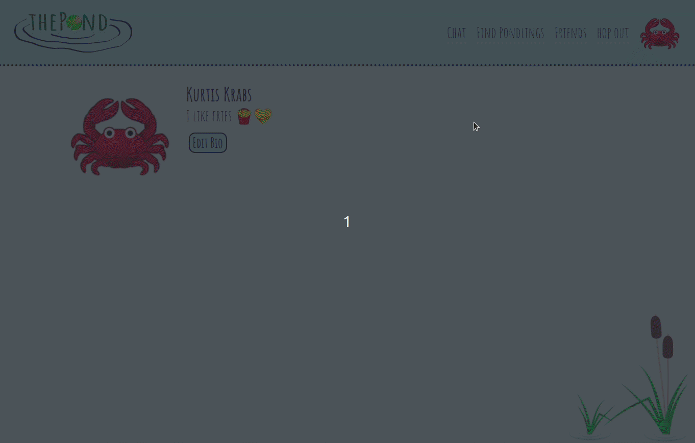

# thePond - social network
React based authenticated social network featuring
friending and chat functionality

## Features
:octopus: Connect with users
:frog: Chat with other users online
:fish: Modify profile information

## Technologies
HTML5, CSS3, JavaScript, React, Node.js/Express,
PostgreSQL, AWS, Socket.IO

## Preview
### REGISTER / LOGIN

### CHANGE PROFILE PICTURE / MODIFY PROFILE information

### FIND OTHER USERS / MAKE FRIENDS

### ONLINE CHAT / SEE WHO'S ONLINE

### MANAGE FRIENDS

